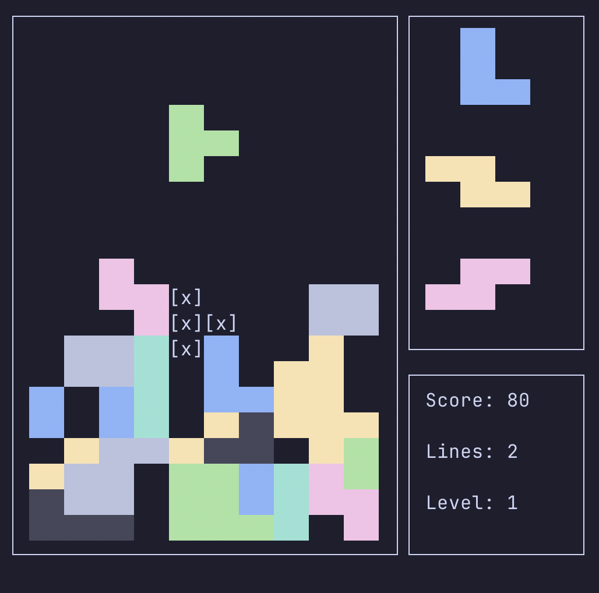

# Terminal Tetris

This is a simple tetris implementation in terminal using standard python libraries.

## Examples

> Some terminals won't display standard colors, if this happens it could look not as in examples.

## Author

- Amir Nurmukhametov [(github)](https://github.com/Hereugo)
